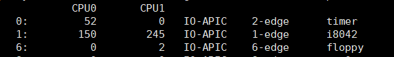
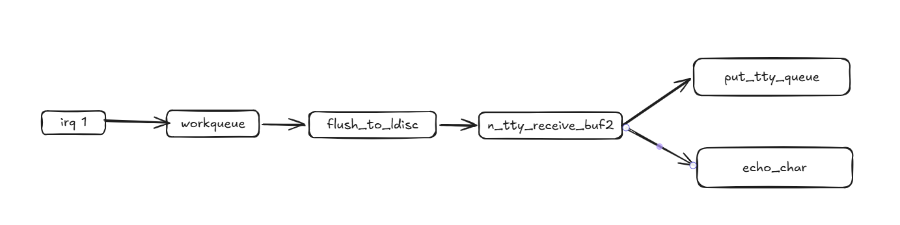
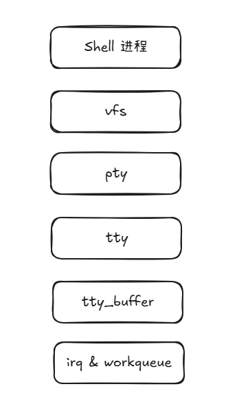
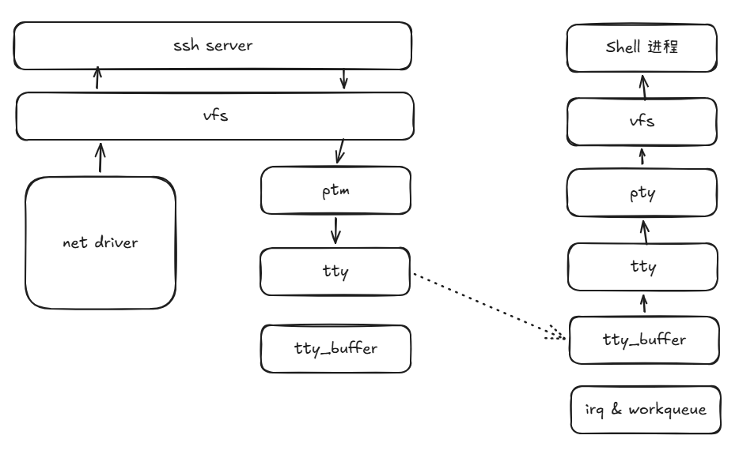
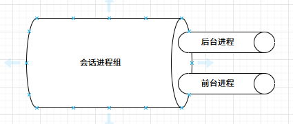

# 伪终端简介
在方案介绍开始前，先回顾下通过连接了解下Linux终端发展：https://zh.wikipedia.org/wiki/%E7%B5%82%E7%AB%AF

终端设备的发展依次经历了**电传打字机（Teletypes）**、支持ANSI转义序列的VT100终端图形设备、基于图形界面（GUI）技术的**伪终端（PTY）** 模拟器，比如xterm等。

# 本地伪终端的处理流程
键盘输入的中断编号1：


以内核4.0的源码作为参考基准，键盘输入后的数据传递流程：


1. 通常keyboard 键盘注册的中断编号为1. 
2. 中断的下半区为 tty_buffer的 workqueue 处理。回调入口为 flush_to_ldisc
3. 传递外设字符，传递到 tty_ldisc_ops 的处理回调指针 n_tty_receive_buf2
4. 在 n_tty_receive_buf2 的处理中，
- 通过 put_tty_queue 将接收外设的字符写入 目标 tty_struct 的缓存中。
- 若 tty 终端的回显标志ECHO为true，通过 echo_char 回写到显示器上。并对某些字符进行转义处理。

shell 进程读取键盘输入的流程： 


这里关键的地方在 结构体 struct file_operations tty_fops 中，其作为 pty 字符设备的默认文件操作指针。

整个的空间结构，从用户态到内核态涉及的关键对象（节点）：


# SSH 方式的伪终端处理流程

框架示意图，表示从远端的终端模拟软件，比如xshell等：


其流的处理，与本地中断的处理方式不同，一个是本地的keyboard 和 终端，一个是网络的keyboard 和 终端。

# 终端与会话进程
在Linux系统中， 终端（伪终端）与会话进程组（Session）的关系，是一对一的关系。 
即1个终端（伪终端）对应1个Session（会话进程组）。
在会话进程组（Session）中，又区分前台进程和后台进程。可以在内核 task_struct 结构体中找到对应的成员（可以参考 setsid的系统调用）。
同时在 struct tty_struct 结构体中，有相关会话进程的 struct pid *session 信息。



# 终端属性
在《Unix系统编程手册》中，第62章有终端的介绍。这里只介绍上面章节提到的**回显标志 ECHO**.
![[Pasted image 20260610162203.png]]

在内核中，表示终端信息的结构体 
```
struct tty_struct {
	...
	// 终端会话进程信息
    struct pid *pgrp;       /* Protected by ctrl lock */
    struct pid *session;
    ...
    // 终端窗口
    struct winsize winsize;     /* winsize_mutex */
    ...
    // 终端属性，保存 ECHO 等标志
    struct ktermios termios, termios_locked;
    struct termiox *termiox;    /* May be NULL for unsupported */
    ...
};
```

# Shell 类型
当前shell种类众多，有常用的 bash、dash、ash、busybox sh等等，但它们大致可以分类两类：
- 允许用户编辑输入命令的，如 bash、ash等
- 不允许用户编辑输入命令的，如dash
## 允许编辑
允许编辑输入命令的处理逻辑为， 当用户输入时， ECHO 标志设置为 false，将keyboard输入的字符原封不动的传递给 shell 进程，由shell进程根据用户的输入（光标跳转、插入、删除等操作）组装成完整的命令，并且shell进程将用户输入的字符原封不动的写入图形显示终端。

## 不允许编辑
不允许编辑输入命令的处理逻辑为， ECHO 标志始终为true，由tty_buffer 的 workqueue，完成命令组装。当shell进程读取时，是一个完整的命令。workqueue根据ECHO标志，将字符回显到终端中。

# 总结
以上是整个终端的大致处理流程。若在终端的数据流程中，将数据拷贝镜像一份，并通过专有的转义解析工具解析，即可达到**伪终端镜像**的功能。结合ECHO的回显标志，即可实现shell输入命令捕获的功能。
